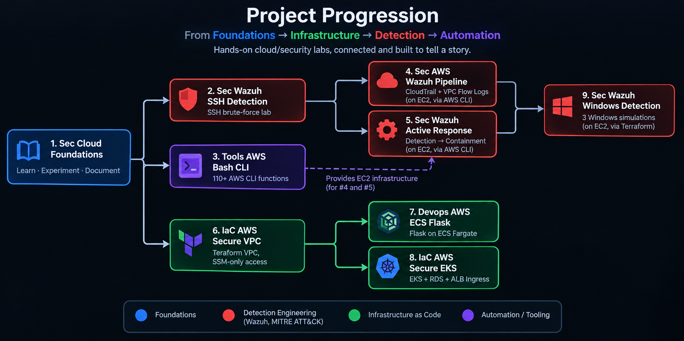

# 👋 Hi, I'm Aman Kumar (Shaurya)

### Cloud • Linux • Detection Engineering • Automation

  

> Most of my open-source work is published under the name **Shaurya**.

I build hands-on cloud/security labs — real infra, real telemetry, real bugs, documented honestly.

---

## 🧭 Project Progression

  

🔵 Foundations · 🔴 Detection engineering (Wazuh, MITRE ATT&CK) · 🟢 Infrastructure as Code · 🟣 Automation tooling

---

## 📂 Projects

> 💡 **Project Progression:** The sequence of numbers (1–9) reflects the chronological order of how these projects were built, with each phase expanding upon previous infrastructure and detection capabilities.

#### 🔵 Foundations

| # | Repo | What it is |
|---|---|---|
| **01** | [Sec Cloud Foundations](https://github.com/shaurya-security/sec-cloud-foundations) | Learning cloud security from scratch — six phases, documented honestly |

#### 🟣 Automation & Tooling

| # | Repo | What it is |
|---|---|---|
| **03** | [Tools AWS Bash CLI](https://github.com/shaurya-security/tools-aws-bash-cli) | 110+ function Bash/AWS CLI toolkit (VPCs, EC2, routing, no Terraform) — *provides EC2 infrastructure for #4 and #5* |

#### 🟢 Infrastructure as Code

| # | Repo | What it is |
|---|---|---|
| **06** | [IaC AWS Secure VPC](https://github.com/shaurya-security/iac-aws-secure-vpc) | Terraform VPC, SSM-only access, CI security checks |
| **07** | [Devops AWS ECS Flask](https://github.com/shaurya-security/devops-aws-ecs-flask) | Flask on ECS Fargate, OIDC, Checkov — *extends #6* |
| **08** | [IaC AWS Secure EKS](https://github.com/shaurya-security/iac-aws-secure-eks) | EKS + RDS + ALB Ingress — *extends #6* |

#### 🔴 Detection Engineering (Wazuh, MITRE ATT&CK)

| # | Repo | What it is |
|---|---|---|
| **02** | [Sec Wazuh SSH Detection](https://github.com/shaurya-security/sec-wazuh-ssh-detection) | SSH brute-force detection lab, MITRE ATT&CK mapping |
| **04** | [Sec AWS Wazuh Pipeline](https://github.com/shaurya-security/sec-aws-wazuh-pipeline) | CloudTrail + VPC Flow Logs into Wazuh, simulated on EC2 — *extends #2, infra via #3* |
| **05** | [Sec Wazuh Active Response](https://github.com/shaurya-security/sec-wazuh-active-response) | Full detection → automated containment → recovery chain, simulated on EC2 — *extends #2, infra via #3* |
| **09** | [Sec Wazuh Windows Detection](https://github.com/shaurya-security/sec-wazuh-windows-detection) | 3 Windows detection simulations, attack to remediation, Terraform-provisioned — *extends #5* |

---

## 💻 Stack

`AWS` `Terraform` `Linux` `Bash` `Wazuh` `MITRE ATT&CK` `Docker` `ECS` `EKS` `GitHub Actions`

---

## Connect

💼 [LinkedIn](https://www.linkedin.com/in/aman-kumar-141495411/)
