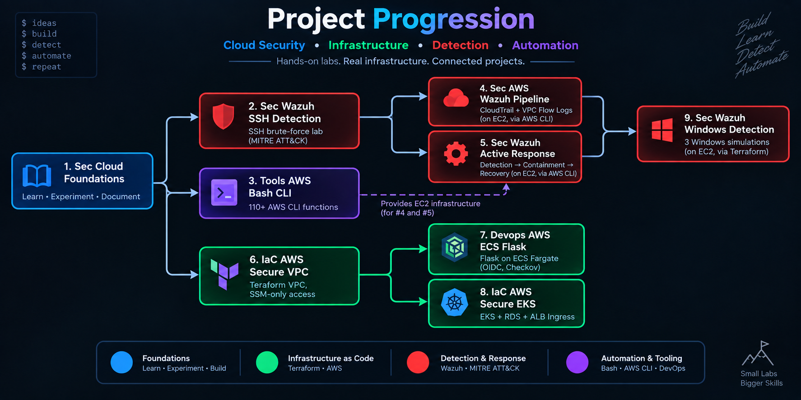

# 👋 Hi, I'm Aman Kumar (Shaurya)

### Cloud • Linux • Detection Engineering • Automation

  

> Most of my open-source work is published under the name **Shaurya**.

I build hands-on cloud/security labs — real infrastructure, real telemetry, and
documented engineering decisions.

---

## 🧭 Project Progression

  

> The diagram shows how projects evolved and depend on one another; the sections
> below classify them by primary focus.

---

## 📂 Projects

> Projects are grouped by primary focus. The **Project Progression** diagram above shows their chronological development and relationships.

  🔵 <strong>Foundations</strong> &nbsp;·&nbsp;
  🔴 <strong>Detection &amp; Response</strong> &nbsp;·&nbsp;
  🟢 <strong>Infrastructure as Code</strong> &nbsp;·&nbsp;
  🟣 <strong>Automation &amp; Tooling</strong>

### 🛡️ Detection & Incident Response

| Type | Repo | What it is | Relationship |
|---|---|---|---|
| 🔵 | [sec-cloud-foundations](https://github.com/shaurya-security/sec-cloud-foundations) | Six-phase cloud security foundation, documented through hands-on labs | *Foundation* |
| 🔴 | [sec-wazuh-ssh-detection](https://github.com/shaurya-security/sec-wazuh-ssh-detection) | SSH brute-force detection + MITRE ATT&CK mapping | *Baseline detection lab* |
| 🔴 | [sec-aws-wazuh-pipeline](https://github.com/shaurya-security/sec-aws-wazuh-pipeline) | CloudTrail + VPC Flow Logs → Wazuh on EC2 | Extends `sec-wazuh-ssh-detection` · Infra via `tools-aws-bash-cli` |
| 🔴 | [sec-wazuh-active-response](https://github.com/shaurya-security/sec-wazuh-active-response) | Detection → automated containment → recovery on EC2 | Extends `sec-wazuh-ssh-detection` · Infra via `tools-aws-bash-cli` |
| 🔴 | [sec-wazuh-windows-detection](https://github.com/shaurya-security/sec-wazuh-windows-detection) | 3 Windows attack → detection → remediation simulations | Extends `sec-wazuh-active-response` · Infra via `iac-aws-secure-vpc` |

### 🏗️ Infrastructure as Code & DevOps

| Type | Repo | What it is | Relationship |
|---|---|---|---|
| 🔵 | [iac-aws-secure-vpc](https://github.com/shaurya-security/iac-aws-secure-vpc) | Secure Terraform VPC with SSM-only access + CI security checks | *Baseline IaC* |
| 🟢 | [devops-aws-ecs-flask](https://github.com/shaurya-security/devops-aws-ecs-flask) | Flask on ECS Fargate with OIDC + Checkov | Extends `iac-aws-secure-vpc` |
| 🟢 | [iac-aws-secure-eks](https://github.com/shaurya-security/iac-aws-secure-eks) | EKS + RDS + ALB Ingress | Extends `iac-aws-secure-vpc` |

### 🛠️ Tooling & Automation

| Type | Repo | What it is | Relationship |
|---|---|---|---|
| 🟣 | [tools-aws-bash-cli](https://github.com/shaurya-security/tools-aws-bash-cli) | 110+ function Bash/AWS CLI toolkit for VPCs, EC2 & routing | *Baseline tooling* |

---

## 💻 Stack

`AWS` `Terraform` `Linux` `Bash` `Wazuh` `MITRE ATT&CK` `Docker` `ECS` `EKS` `GitHub Actions`

---

## Connect

💼 [LinkedIn](https://www.linkedin.com/in/aman-kumar-141495411/)
